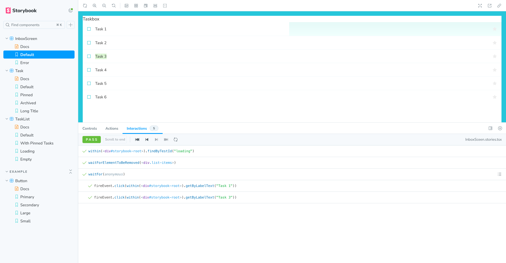

<h1 align="center">
  Storybook React Vite TypeScript Boiler Template
</h1>

This template ships with the main React and Storybook configuration files you'll need to get up and running fast.

## 🚅 Quick start

1.  **Create the application.**

    Use [degit](https://github.com/Rich-Harris/degit) to get this template.

    ```shell
    # Clone the template
    npx degit harryho/storybook-react-vite-ts-template new-react-project
    ```

1.  **Install the dependencies.**

    Navigate into your new site’s directory and install the necessary dependencies.

    ```shell
    # Navigate to the directory
    cd  new-react-project/

    # Install the dependencies
    yarn
    ```

1.  **Open the source code and start editing!**

    Open the `components` directory in your code editor of choice and build your first component!


1.  **Create the stories and interactions!**

    Open the `stories` directory in your code editor of choice and build your stories!

1.  **Browse your stories!**

    Run `yarn storybook` to see your component's stories at `http://localhost:6006`

1. **Test your stories!**

    Run `yarn test-storybook` or run `yarn watch-test-storybook` to see test result.

## Screenshot




## 🔎 What's inside?

A quick look at the top-level files and directories included with this template.

    .
    ├── .storybook
    ├── node_modules
    ├── public
    ├── src
        |-- components
        |-- stories
    ├── .eslintrc.cjs
    ├── .gitignore
    ├── .index.html
    ├── LICENSE
    ├── package.json
    ├── tsconfig.json
    ├── tsconfig.vite.json       
    ├── yarn.lock
    ├── vite.config.ts
    └── README.md

1.  **`.storybook`**: This directory contains Storybook's [configuration](https://storybook.js.org/docs/react/configure/overview) files.

2.  **`node_modules`**: This directory contains all of the modules of code that your project depends on (npm packages).

3.  **`public`**: This directory will contain the development and production build of the site.

4.  **`src`**: This directory will contain all of the code related to what you will see on your application.

5.  **`components`**: This directory will contain all of the code related to what components you want to build.

6.  **`stories`**: This directory will contain all of the code related to what stories you want to test with your components.

7.  **`.eslintrc.cjs`**: This file is the configuration file for [ESLint](https://eslint.org/), a tool for identifying and reporting on patterns found in ECMAScript/JavaScript code.

8.  **`.gitignore`**: This file tells git which files it should not track or maintain during the development process of your project.

9.  **`.index.html`**: This is the HTML page that is served when generating a development or production build.

10. **`LICENSE`**: The template is licensed under the MIT licence.

11. **`package.json`**: Standard manifest file for Node.js projects, which typically includes project specific metadata (such as the project's name, the author among other information). It's based on this file that npm will know which packages are necessary to the project.

12. **`tsconfig.json`**: This is the configuration file for [TypeScript](https://www.typescriptlang.org/) specifies the root files and the compiler options required to compile the project.
    
13. **`tsconfig.vite.json`**: This is the configuration file for [Vite](https://vitejs.dev/). Vite itself including its config is running on your computer inside Node, which is totally different environment (compared with browser) with different API's and constraints.

14. **`yarn.lock`**: This is an automatically generated file based on the exact versions of your npm dependencies that were installed for your project. **(Do not change it manually).**

15. **`vite.config.ts`**: This is the configuration file for [Vite](https://vitejs.dev/), a build tool that aims to provide a faster and leaner development experience for modern web projects.

16. **`README.md`**: A text file containing useful reference information about the project.


## Contribute

If you encounter an issue with the template, we encourage you to open an issue in this template's repository.

## Learning Storybook

1. Read our introductory tutorial at [Learn Storybook](https://storybook.js.org/tutorials/intro-to-storybook/react/en/get-started/).

1. Learn how to transform your component libraries into design systems in our [Design Systems for Developers](https://storybook.js.org/tutorials/design-systems-for-developers/) tutorial.

1. See our official documentation at [Storybook](https://storybook.js.org/).

